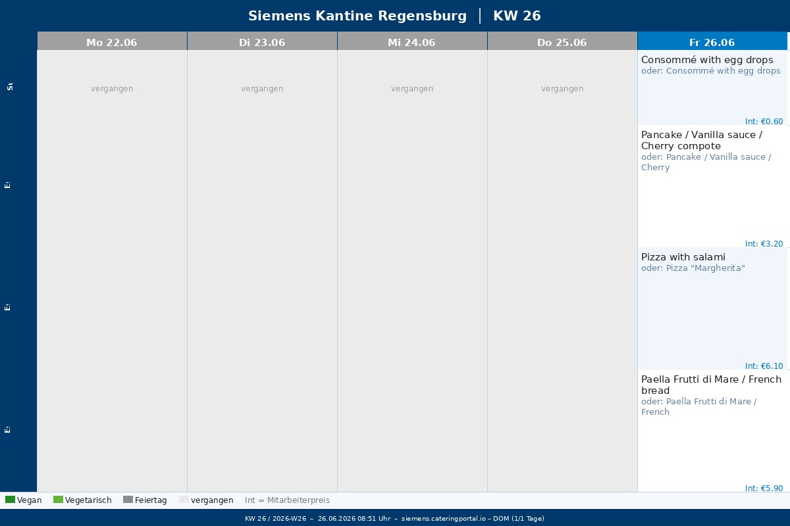

# Siemens Kantine Regensburg – Photoframe

> Automatischer Wochenmenü-Screenshot für den **Philips 8FF3WMI Bilderrahmen** (800 × 600 px).

---

## Was macht dieses Projekt?

1. **Scrapen** – Ein Playwright-Script lädt den Speiseplan von [siemens.cateringportal.io](https://siemens.cateringportal.io/menu/Regensburg/Mittagessen) und extrahiert strukturierte Daten direkt aus dem DOM.
2. **Rendern** – Die Daten werden als 800 × 600 JPEG gerendert – optimiert für den Bilderrahmen.
3. **RSS-Feed** – Ein RSS-Feed wird automatisch erzeugt, sodass der Bilderrahmen das aktuelle Bild via URL abrufen kann.
4. **GitHub Actions** – Der gesamte Ablauf ist vollständig automatisiert.

---

## Aktuelles Bild



---

## Automatischer Zeitplan

| Zeitpunkt | Uhrzeit (DE) | Aktion |
|-----------|-------------|--------|
| Täglich | 02:00 Uhr | Aktuelle Woche neu generieren (korrekter Tagesstatus) |
| Do + Fr | 16:00 Uhr | Nächste Woche vorabladen |
| Manuell | jederzeit | Workflow Dispatch mit `week_offset` 0 oder 1 |

> Das Nachtupdate um 02:00 Uhr stellt sicher, dass vergangene Tage korrekt als "vergangen" markiert sind und das Bild immer den aktuellen Stand widerspiegelt.

---

## Render-Details

- **Auflösung:** 800 × 600 px (JPEG, Qualität 92)
- **Kategorien:** Suppe / Essen 1 / Essen 2 / Essen 3
- **Badges:** Vegan, Vegetarisch
- **Alternativen:** `oder` nur bei explizitem Portal-Separator, sonst `mit`
- **Zusatz:** wahlweise-Beilagen (z. B. Parmesan mit Preis)
- **Feiertage:** Bayerische Feiertage werden erkannt und angezeigt
- **Heute:** Aktueller Tag wird golden hervorgehoben
- **Vergangene Tage:** Werden grau ausgegraut
- **Einheitliche Schriftgröße** pro Zeile – alle Zellen haben dieselbe Schriftgröße

---

## Verzeichnisstruktur

```
.github/
  workflows/
    screenshot.yml      # GitHub Actions Workflow
scripts/
  take_screenshot.py   # Scraping + Rendering
  generate_rss.py      # RSS-Feed Generierung
docs/
  images/
    latest.jpg         # Aktuellstes Bild (symlink-äquivalent)
    kantine_YYYY-WNN.jpg  # Archiv (max. 8 Bilder)
  feed.xml             # RSS-Feed
```

---

## RSS-Feed für den Bilderrahmen

Der Bilderrahmen (Philips 8FF3WMI) kann einen RSS-Feed mit Bildern abonnieren.

**Feed-URL:**
```
https://raw.githubusercontent.com/basecore/siemens-kantine-photoframe/main/docs/feed.xml
```

Alternativ direkt das aktuelle Bild:
```
https://raw.githubusercontent.com/basecore/siemens-kantine-photoframe/main/docs/images/latest.jpg
```

---

## Lokale Ausführung

### Voraussetzungen

```bash
pip install playwright Pillow
python -m playwright install chromium
sudo apt-get install -y fonts-dejavu fonts-liberation  # Linux
```

### Ausführen

```bash
# Nächste Woche (Standard)
python scripts/take_screenshot.py

# Aktuelle Woche
WEEK_OFFSET=0 python scripts/take_screenshot.py

# RSS-Feed generieren
python scripts/generate_rss.py
```

Das Bild wird unter `docs/images/kantine_YYYY-WNN.jpg` gespeichert.

---

## Umgebungsvariablen

| Variable | Standard | Beschreibung |
|----------|----------|--------------|
| `WEEK_OFFSET` | `1` | `0` = aktuelle Woche, `1` = nächste Woche |
| `CATERINGPORTAL_URL` | Siemens Regensburg URL | Portal-URL |
| `CATERINGPORTAL_SID` | – | Session-ID (optional, als GitHub Secret) |

---

## GitHub Secret

Falls das Portal eine Session-ID benötigt, kann diese als Secret hinterlegt werden:

```
Settings → Secrets and variables → Actions → New repository secret
Name: CATERINGPORTAL_SID
Value: <deine Session-ID>
```

---

## Technische Details

### Scraping-Strategie

- **DOM-basiert** (kein `innerText`): Strukturierte Daten werden per JavaScript direkt aus Angular-Komponenten extrahiert.
- **Deduplication:** Angular rendert jeden Eintrag doppelt (Animations-Artefakt) – wird automatisch gefiltert.
- **Sprachumschaltung:** Das Portal wird automatisch auf Deutsch umgestellt und die Einstellung in `localStorage` gespeichert.
- **Fallback:** Falls die DOM-Extraktion fehlschlägt, greift ein `innerText`-Parser als Backup.

### Kategorien-Mapping

| Portal-Kategorie | Anzeige |
|-----------------|----------|
| Suppe / Vorspeise | Suppe (Su.) |
| Essen 1 / Food 1 | Essen 1 (E1) |
| Essen 2 / Vegan / Vegetarisch | Essen 2 (E2) |
| Essen 3 / Fisch | Essen 3 (E3) |

---

## Hardware

**Philips 8FF3WMI Digital Photo Frame**
- Auflösung: 800 × 600 px
- RSS-Feed-Unterstützung für automatische Bildaktualisierung
- Das Bild wird täglich um 02:00 Uhr (deutsche Zeit) aktualisiert
